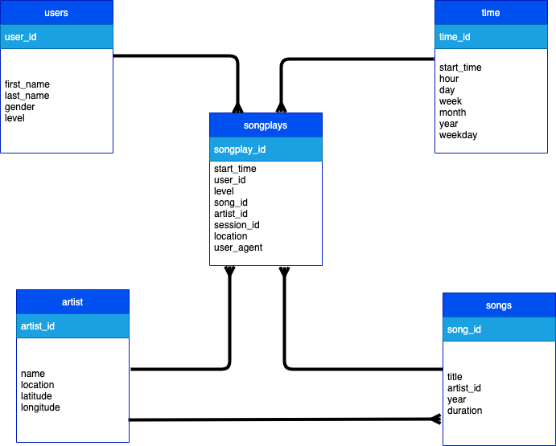

# UDACITY-DWH-ETL

## Business Requirements
A music streaming startup, Sparkify, has grown their user base and song database and want to move their processes and data onto the cloud. 

## Scope
Their data resides in S3, in a directory of JSON logs on user activity on the app, as well as a directory with JSON metadata on the songs in their app.


## Project Structure
* `dwh.cfg` contains config data


## Source Data
* song_data
```json
{"num_songs": 1, "artist_id": "ARJIE2Y1187B994AB7", "artist_latitude": null, "artist_longitude": null, "artist_location": "", "artist_name": "Line Renaud", "song_id": "SOUPIRU12A6D4FA1E1", "title": "Der Kleine Dompfaff", "duration": 152.92036, "year": 0}

```

* log_data


## Star Schema Data Model


## Workflow


